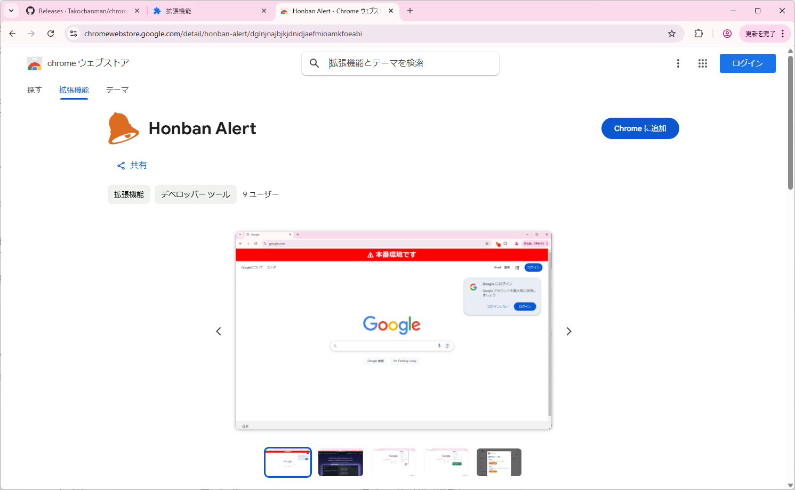
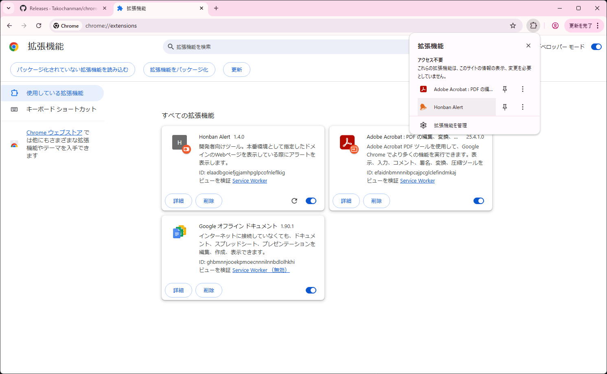
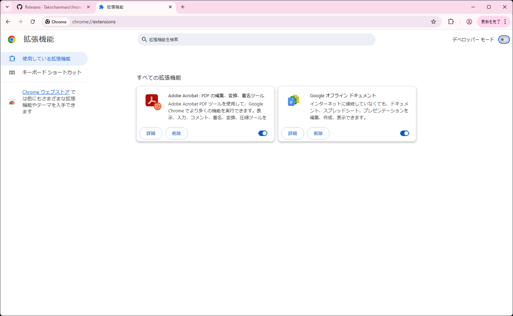
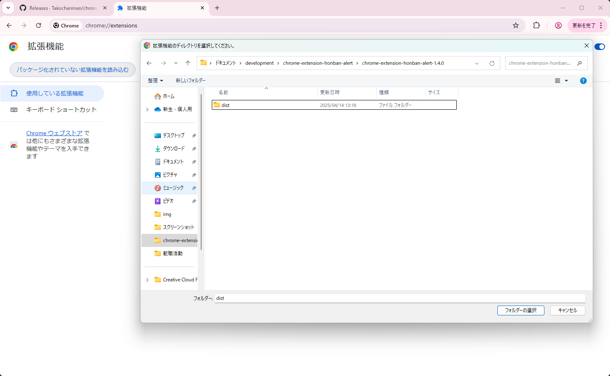

# Chrome Extension Honban Alert

開発者向け拡張機能。  
本番環境として指定したドメインに対するアラートやリクエストブロック機能にて、意図せず本番環境を操作してしまうことを防ぎます。

## Features
### バナー表示機能
- 指定したドメインのWebサイト上にアラートバナーを表示します。
- バナー表示時も画面上の操作を行うことは可能ですが、本番環境下でデザインの確認を行う場合等では、デザイン崩れを防ぐためにOFFにすることをおすすめします。

### リクエストブロック機能
- 指定したドメインへのリクエストをブロックし、サーバーへのリクエストを未然に防ぎます。
- Ajaxなどの非同期で実行されるリクエストを含む、全リクエストをブロックします。

### POSTブロック機能
- 指定したドメインへのPOSTリクエストのみをブロックします。  
※Ajaxなど非同期で実行されるリクエストもブロックされます。

## Settings
拡張機能のアイコンをクリックすると、各種設定が行えるポップアップが表示されます。
### 各種機能ON/OFF設定

- 下記3つの機能ごとにON/OFFの切り替えが可能です。
  - バナー表示機能
  - リクエストブロック機能
  - POSTリクエストブロック機能  

### ドメイン設定

- アラートやリクエストブロックの対象となるドメインを設定します。
- ドメインは複数設定可能で、いつでも追加、修正、削除が可能です。
  - ドメインを追加する際は、左下の「＋」を押下し、新たに作成されたテキストボックスに入力します。
  - ドメインを修正する際は、修正したいドメインの右側にある「鉛筆マーク」を押下し、テキストボックスに入力します。
  - ドメインを削除する際は、削除したいドメインの右側にある「×」を押下します。
  - 追加、修正、削除の操作を行った際は、最後に「保存」ボタンを押下します。  
  ※保存ボタンを押下せずにポップアップを閉じた場合、設定は保存されません。
- ドメインは正規表現（^と$のみ）で指定可能です。
  - OK例）`example.com`  
  → xxx.example.comなど、example.comを含む全てのドメインに適用されます。
  - OK例）`^example.com$`  
  → example.comのみ適用されます。
  - NG例）`^https://example.com$`  
  → 指定できるのはドメインのみです。

### 設定インポート／エクスポート設定
  
- ポップアップ下部にある「オプション」を押下すると、設定のインポート／エクスポートが行える設定画面に遷移します。
- 設定のインポート／エクスポートは、JSON形式で行います。
- インポート
  - 「ファイル選択」ボタンを押下し、インポートしたいJSONファイルを選択します。
  - ファイル名が正しいことを確認し、「インポート」ボタンを押下します。
- エクスポート
  - 「エクスポート」ボタンを押下し、現在の設定をJSON形式でエクスポートします。
  - エクスポートされたファイルを他のPCにインポートすることで、同じ設定を行うことができます。

## Usage

### Chrome Web Storeよりインストール
1. [Chrome Web Store](https://chromewebstore.google.com/detail/honban-alert/dglnjnajbjkjdnidjaefmioamkfoeabi)からインストールします。

2. インストール後、Chromeの拡張機能アイコンから「Honban Alert」を選択します。

3. ポップアップが表示されるので、各種設定を行います。

### ローカルでのインストール
1. [リリースノート](https://github.com/Takochanman/chrome-extension-honban-alert/releases)にあるzipファイルをダウンロードします。
2. zipファイルを解凍します。
3. [Chromeの拡張機能ページ](chrome://extensions/)を開きます。

4. 右上の「デベロッパーモード」をONにします。

5. 「パッケージ化されていない拡張機能を読み込む」を押下し、解凍したフォルダ（dict）を選択します。

6. インストール後、Chromeの拡張機能アイコンから「Honban Alert」を選択します。

7. ポップアップが表示されるので、各種設定を行います。

---

以上です！🎉
