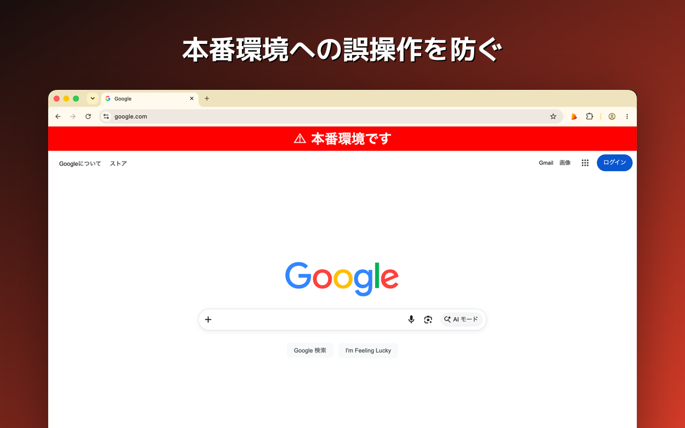
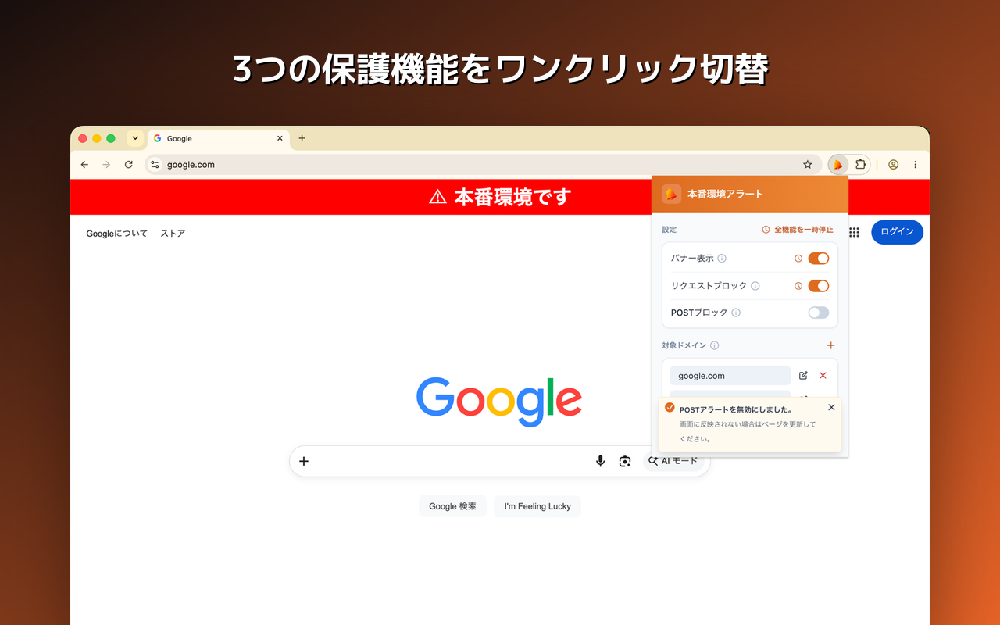
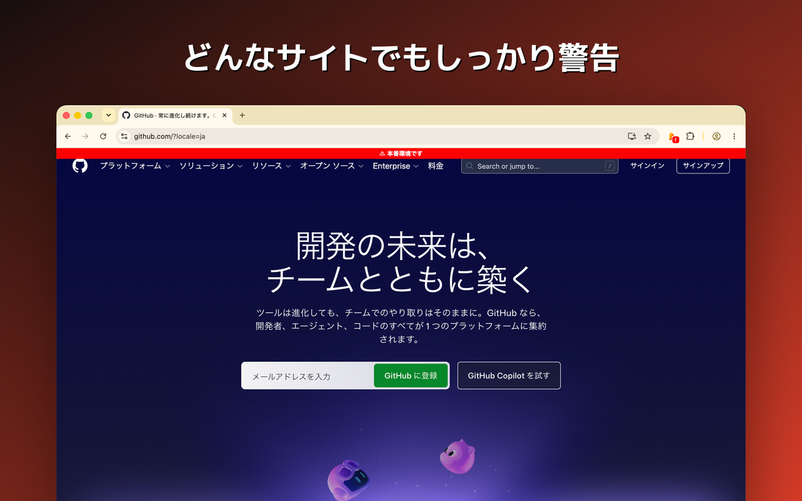
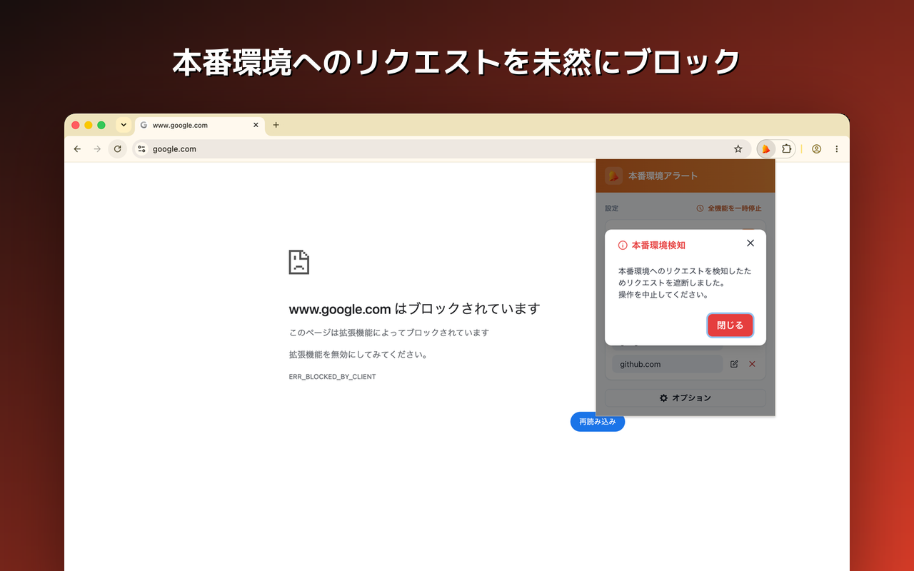
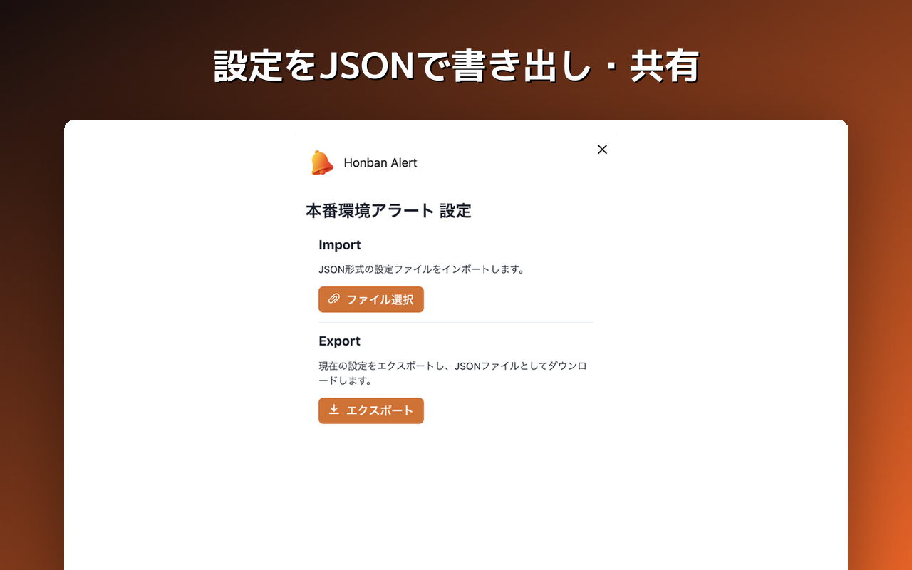
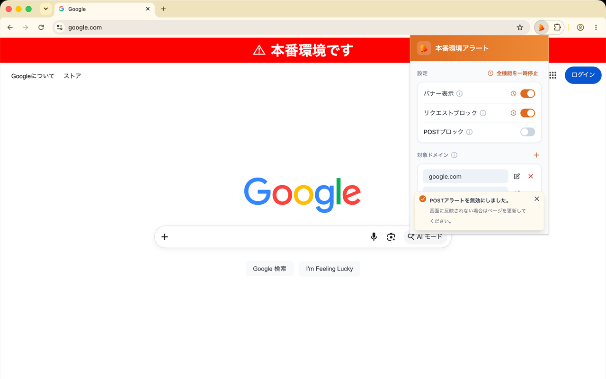
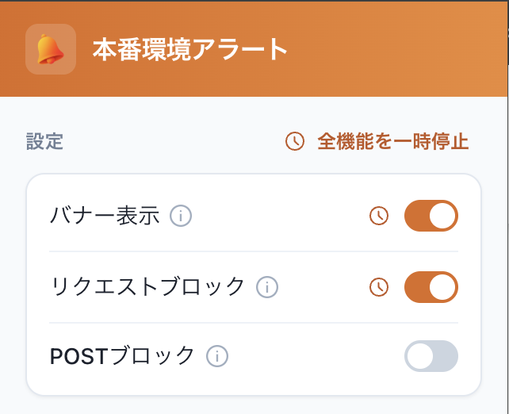
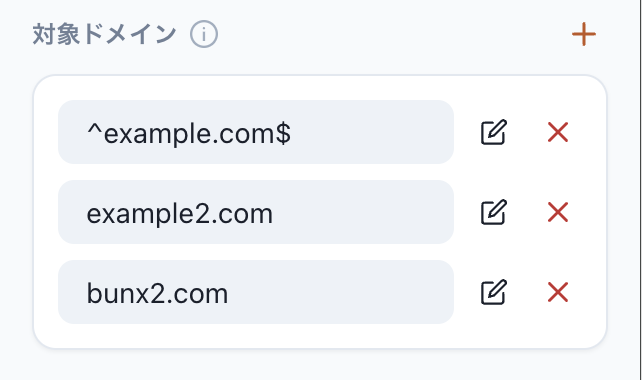
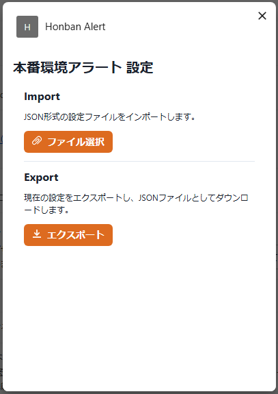

# Chrome Extension Honban Alert

開発者向け拡張機能。  
本番環境として指定したドメインに対するアラートやリクエストブロック機能にて、意図せず本番環境を操作してしまうことを防ぎます。

## Features

### バナー表示機能

- 指定したドメインの Web サイト上にアラートバナーを表示します。
- バナー表示時も画面上の操作を行うことは可能ですが、本番環境下でデザインの確認を行う場合等では、デザイン崩れを防ぐために OFF にすることをおすすめします。

### リクエストブロック機能

- 指定したドメインへのリクエストをブロックし、サーバーへのリクエストを未然に防ぎます。
- Ajax などの非同期で実行されるリクエストを含む、全リクエストをブロックします。

### POST ブロック機能

- 指定したドメインへの POST リクエストのみをブロックします。  
  ※Ajax など非同期で実行されるリクエストもブロックされます。

**一時停止機能**

デザイン確認など、一時的に機能を OFF にしたい場合のための機能です。

- ON になっている機能の横に表示される時計アイコンを押すと、一時停止する時間（分単位、最大 999 分）を指定するモーダルが表示されます。
- 指定した時間が経過すると、自動的に元の ON 状態に戻ります。
- 一時停止中は、残り時間がバッジで表示されます。
- ポップアップ右上の「全機能を一時停止」を押すと、その時点で ON になっている機能をまとめて一時停止することも可能です。

## Settings

拡張機能のアイコンをクリックすると、各種設定が行えるポップアップが表示されます。

### 各種機能 ON/OFF 設定

- 下記 3 つの機能ごとに ON/OFF の切り替えが可能です。
  - バナー表示機能
  - リクエストブロック機能
  - POST リクエストブロック機能

### ドメイン設定

- アラートやリクエストブロックの対象となるドメインを設定します。
- ドメインは複数設定可能で、いつでも追加、修正、削除が可能です。
  - ドメインを追加する際は、左下の「＋」を押下し、新たに作成されたテキストボックスに入力します。
  - ドメインを修正する際は、修正したいドメインの右側にある「鉛筆マーク」を押下し、テキストボックスに入力します。
  - ドメインを削除する際は、削除したいドメインの右側にある「×」を押下します。
  - 追加、修正、削除の操作を行った際は、最後に「保存」ボタンを押下します。  
    ※保存ボタンを押下せずにポップアップを閉じた場合、設定は保存されません。
- ドメインは正規表現（^と$のみ）で指定可能です。
  - OK 例）`example.com`  
    → xxx.example.com など、example.com を含む全てのドメインに適用されます。
  - OK 例）`^example.com$`  
    → example.com のみ適用されます。
  - NG 例）`^https://example.com$`  
    → 指定できるのはドメインのみです。

### 設定インポート／エクスポート設定

- ポップアップ下部にある「オプション」を押下すると、設定のインポート／エクスポートが行える設定画面に遷移します。
- 設定のインポート／エクスポートは、JSON 形式で行います。
- インポート
  - 「ファイル選択」ボタンを押下し、インポートしたい JSON ファイルを選択します。
  - ファイル名が正しいことを確認し、「インポート」ボタンを押下します。
- エクスポート
  - 「エクスポート」ボタンを押下し、現在の設定を JSON 形式でエクスポートします。
  - エクスポートされたファイルを他の PC にインポートすることで、同じ設定を行うことができます。

## Usage

### Chrome Web Store よりインストール

1. [Chrome Web Store](https://chromewebstore.google.com/detail/honban-alert/dglnjnajbjkjdnidjaefmioamkfoeabi)からインストールします。
2. インストール後、Chrome の拡張機能アイコンから「Honban Alert」を選択します。
3. ポップアップが表示されるので、各種設定を行います。

### ローカルでのインストール

1. [リリースノート](https://github.com/Takochanman/chrome-extension-honban-alert/releases)にある zip ファイルをダウンロードします。
2. zip ファイルを解凍します。
3. [Chrome の拡張機能ページ](chrome://extensions/)を開きます。
4. 右上の「デベロッパーモード」を ON にします。
5. 「パッケージ化されていない拡張機能を読み込む」を押下し、解凍したフォルダ（honban-alert-vx.x.x）を選択します。
6. インストール後、Chrome の拡張機能アイコンから「Honban Alert」を選択します。
7. ポップアップが表示されるので、各種設定を行います。

---

以上です！🎉
